# 智能校园失物招领系统 - 流程图与用户旅程

> **版本**：v1.0  
> **更新日期**：2025-03-22  
> 本文档使用 Mermaid 语法，可在 VS Code（安装 Mermaid 插件）、GitHub、GitLab 或 [Mermaid Live](https://mermaid.live/) 中渲染

---

## 一、核心业务流程图

### 1.1 失物/招领发布流程

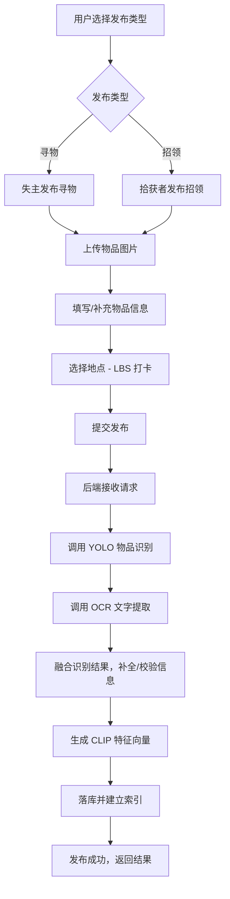

> **补充说明**：YOLO、OCR、CLIP 的调用顺序与并联/串联策略可根据实际接口设计调整（如 OCR 与 YOLO 可并行以缩短耗时）。

### 1.2 以图搜图流程

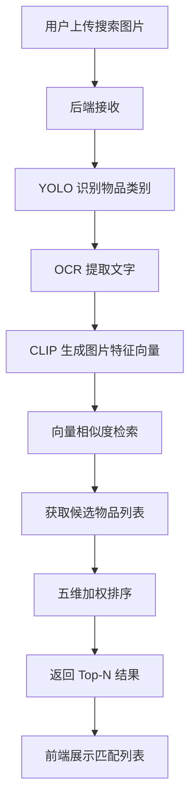

### 1.3 智能推荐流程（相关失物推荐）

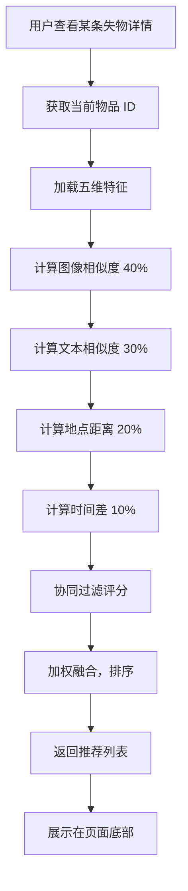

> **补充说明**：五维权重来自 PPT。协同过滤可基于「用户浏览/收藏/联系」等行为构建，具体实现见算法设计文档。

### 1.4 认领对接流程

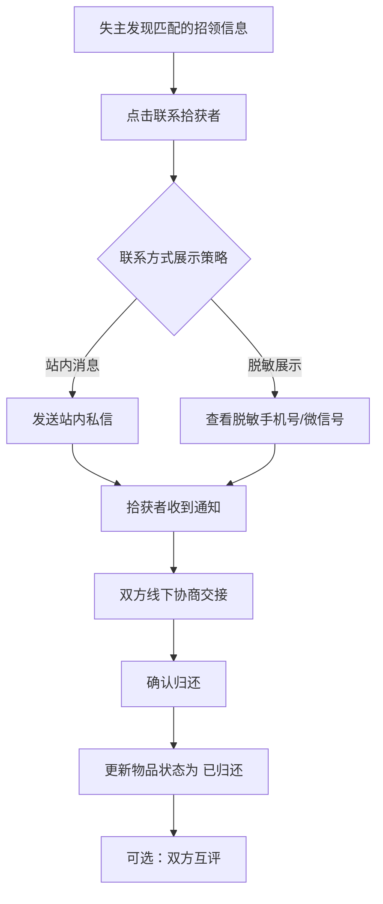

> **补充说明**：联系方式的展示方式（站内消息 vs 脱敏展示）需结合隐私与产品策略确定，此处列出两种常见方案。

---

## 二、系统数据流图

### 2.1 发布接口数据流

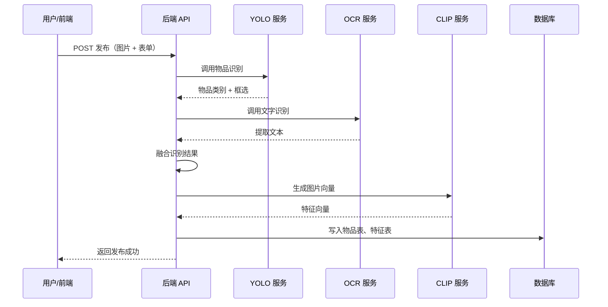

### 2.2 搜索接口数据流

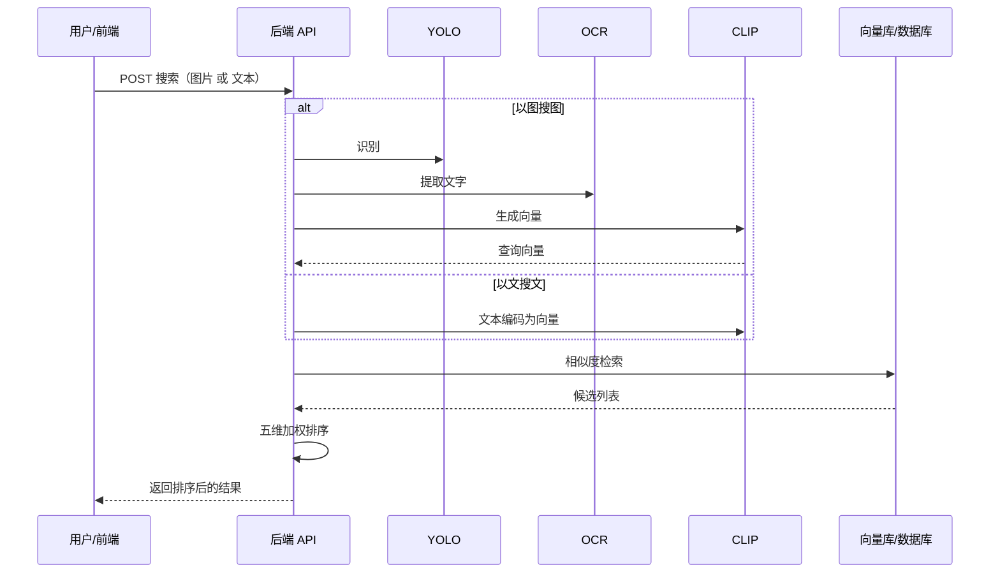

> **补充说明**：向量库可采用 MySQL + 向量扩展、Milvus、Elasticsearch 等，具体选型见技术方案。

---

## 三、用户旅程 (User Journey)

### 3.1 失主寻物旅程

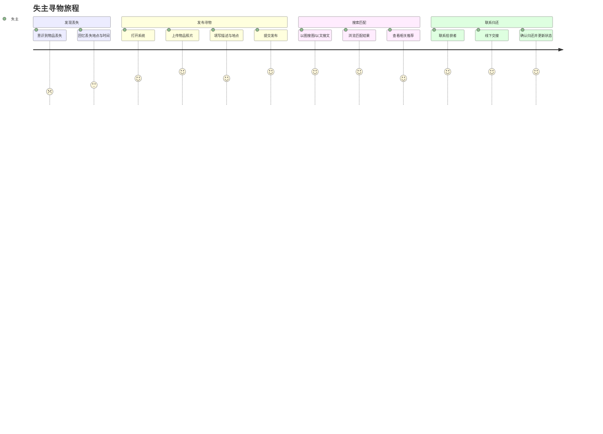

### 3.2 拾获者招领旅程

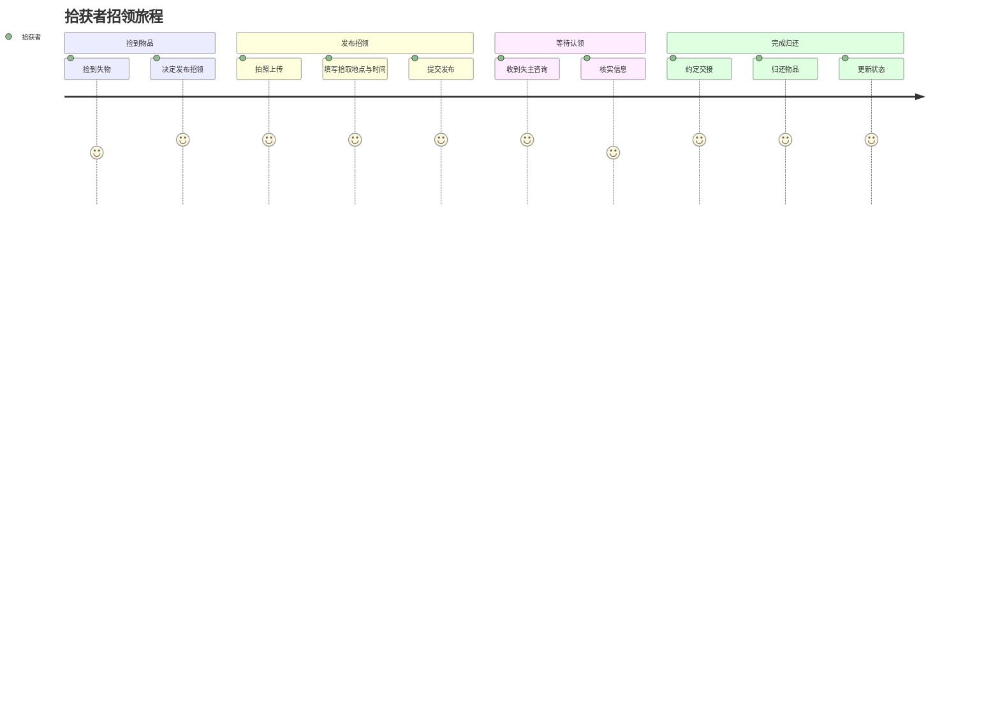

---

## 四、状态机

### 4.1 物品状态流转

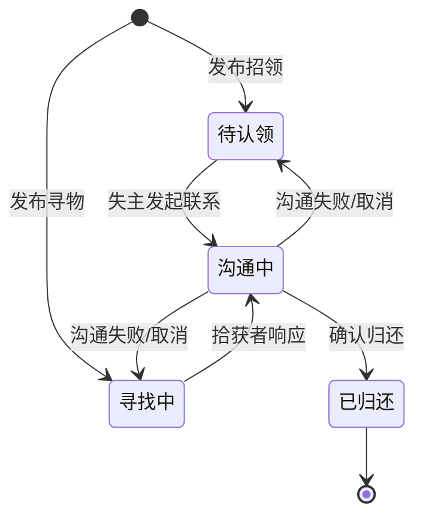

> **补充说明**：状态命名可根据业务习惯调整为「待匹配」「已匹配」「已交接」等。

### 4.2 用户操作与系统响应

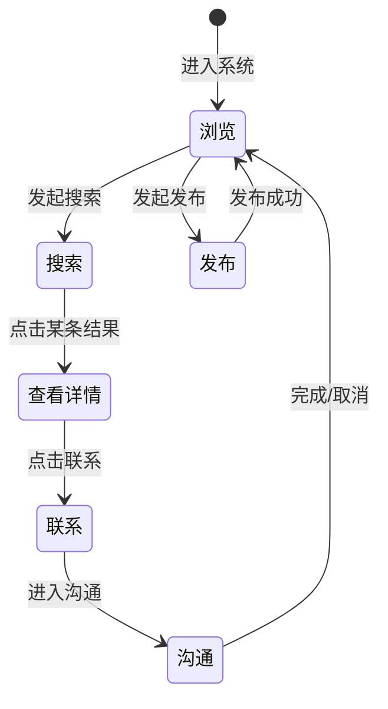

---

## 五、ER 关系示意（概念级）

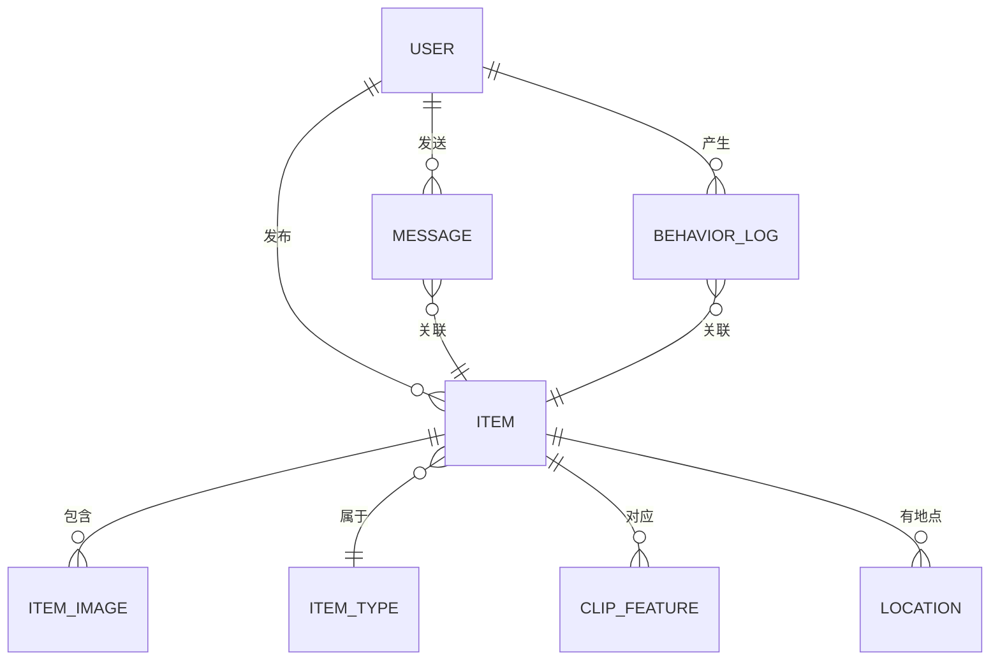

> **补充说明**：具体表结构见 `../03_database/` 下的建表 SQL 与数据字典。

---

## 六、渲染说明

| 环境 | 说明 |
|------|------|
| VS Code | 安装 `Markdown Preview Mermaid Support` 插件后预览 |
| GitHub / GitLab | 原生支持 Mermaid 渲染 |
| 在线 | 复制到 [Mermaid Live Editor](https://mermaid.live/) 查看 |
